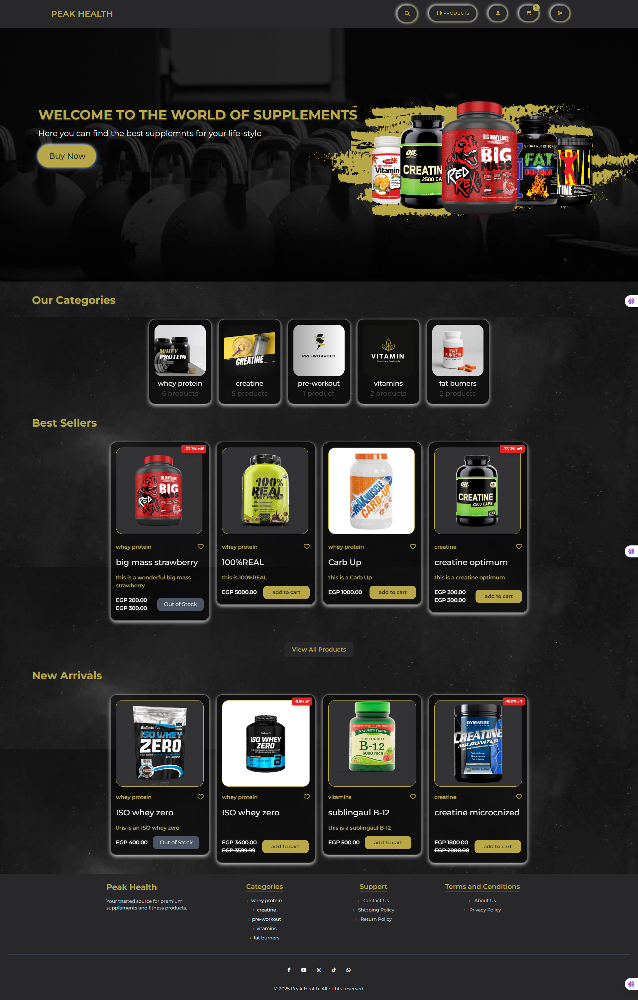
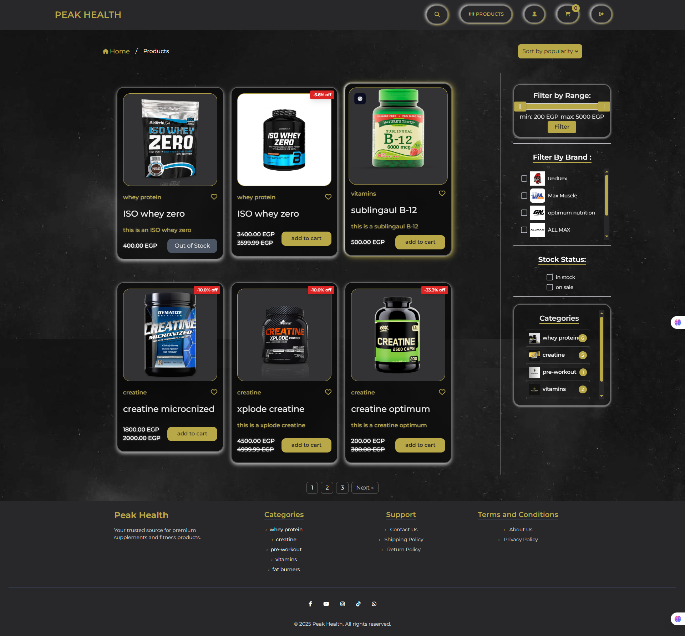
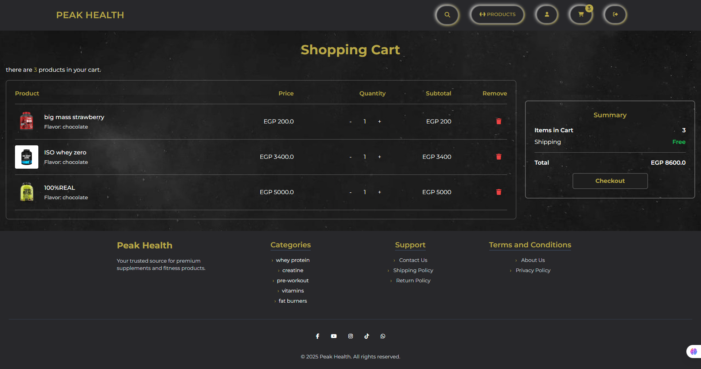
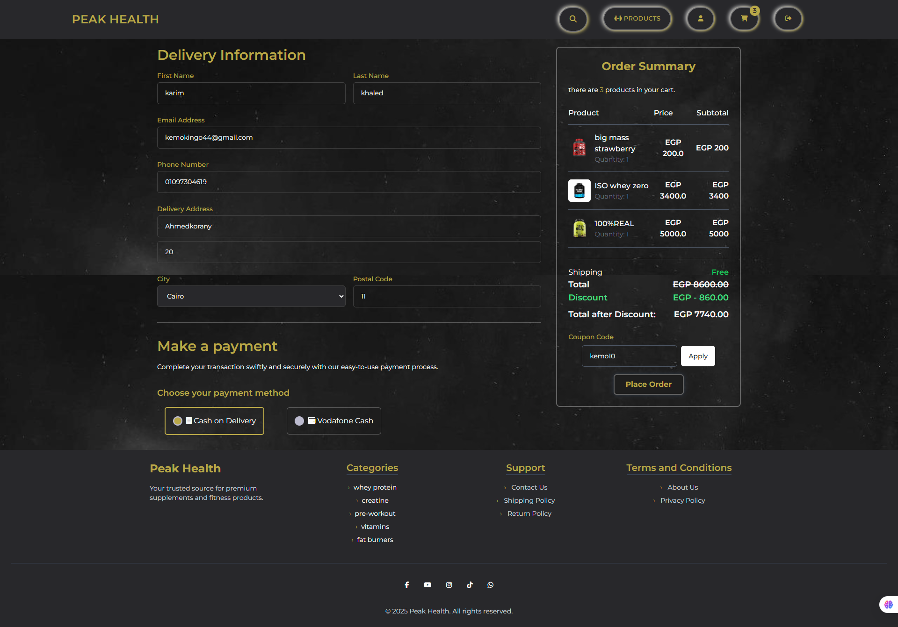
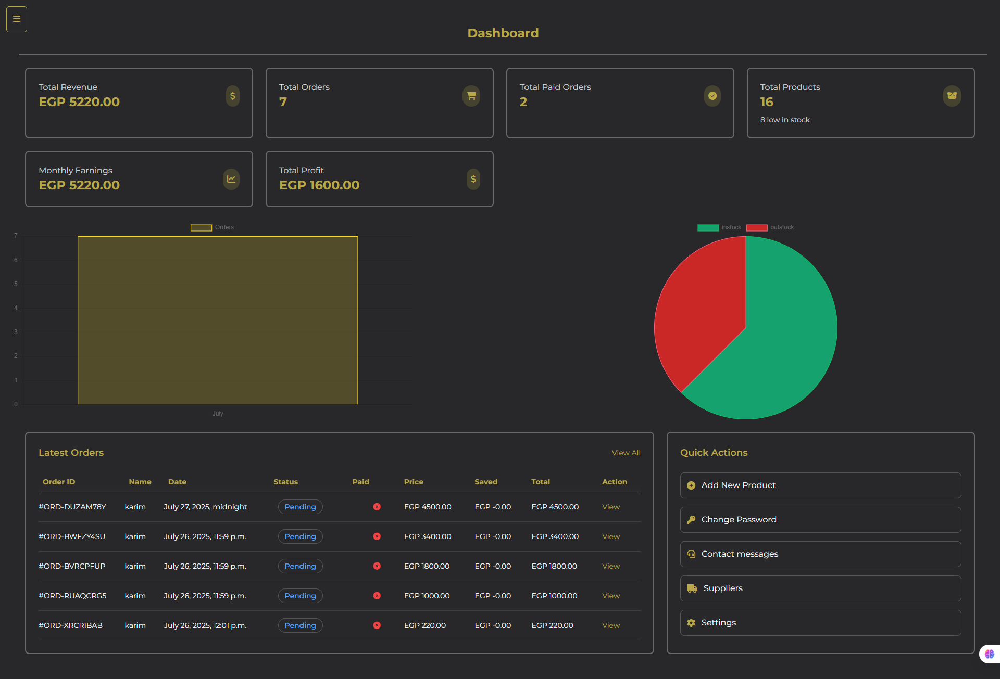

# 🛒 Supplement Store – Free Version

+ A simple and responsive Django + TailwindCSS e-commerce platform tailored for supplement stores.

This free version includes basic e-commerce functionality like product listing, cart management, and checkout. It's perfect for learning or small-scale projects.

👉 **Want more features?** Check out the [Pro Version](#) for full admin dashboard, reports, accounting, and advanced user experience.

---

## 🚀 Features

- AJAX-based product filtering & search
- Shopping cart with live updates
- Checkout with Cash on Delivery only
- User registration, login, and profile
- Mobile-friendly, responsive layout (TailwindCSS)
- Admin interface for managing products, categories, orders

---

## 📸 Screenshots

| Home Page             | Product List + Filters     |
|-----------------------|----------------------------|
|  |  |

| Cart Page             | Checkout Page             |
|-----------------------|---------------------------|
|  |  |

| User Dashboard        | Admin Dashboard           |
|-----------------------|---------------------------|
|  |  |

---

## 🌐 Live Demo

Try the live version of the website here:  
👉 [View Demo](https://my-django-site-d0vm.onrender.com)


## ⚙️ Installation & Setup

1. Clone the repository:
```bash
git clone https://github.com/KareemKhaled44/my-django-site.git
cd supplement-free
pip install -r requirements.txt
```
## ⚙️ Usage

1. Apply migrations:
```bash
python manage.py migrate
```
2. Create a superuser (to access the admin panel):
```bash
python manage.py createsuperuser
```
3. Run the development server:
```bash
python manage.py runserver
```
## 📁 Project Structure
<pre>
📦 supplement-free/                 # Main project folder
├── core/                    # Homepage, contact, and static content views
├── ecommerce/               # Project settings, URLs, WSGI
├── media/                   # Uploaded product and user images
├── node_modules/            # Frontend dependencies managed by npm
├── static/                  # Tailwind, custom JS/CSS
├── staticfiles/             # Collected static files (for production)
├── templates/               # HTML templates (shared across apps)
├── useradmin/               # Admin dashboard
├── userauths/               # User login, register, profile, password reset
├── db.sqlite3               # SQLite database (development)
├── manage.py                # Django CLI entrypoint
├── requirements.txt         # Python dependencies
├── tailwind.config.js       # Tailwind CSS configuration
├── postcss.config.js        # PostCSS setup for Tailwind
├── package.json             # JS dependencies and build scripts
├── package-lock.json        # Exact versions of JS packages
└── Procfile                 # Deployment entrypoint for platforms like Heroku
</pre>

## 📬 Contact
For questions or business inquiries:
📧 kemokingo44@gmail.com

## 🔓 License
This project is available under the MIT License. Feel free to use and modify for personal or educational use.
