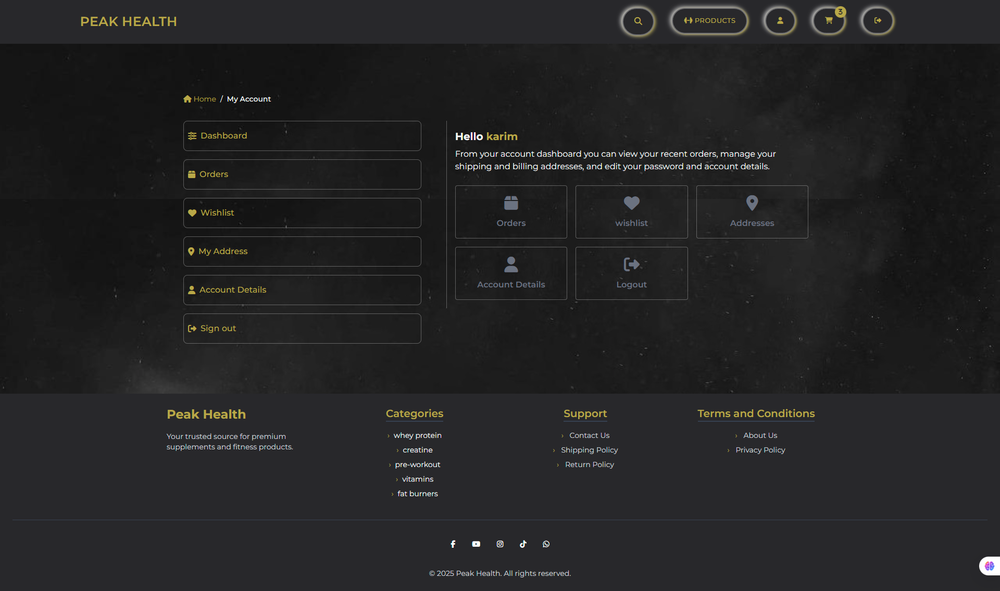

# 🛒 Supplement Store – Free Version

A simple and responsive e-commerce platform built with Django and TailwindCSS for supplement stores.

This free version includes basic e-commerce functionality like product listing, cart management, and checkout. It's perfect for learning or small-scale projects.

👉 **Want more features?** Check out the [Pro Version](#) for full admin dashboard, reports, accounting, and advanced user experience.

---

## 🚀 Features

- AJAX-based product filtering & search
- Shopping cart with live updates
- Checkout with Cash on Delivery only
- User registration, login, and profile
- Mobile-friendly, responsive layout (TailwindCSS)
- Admin interface for managing products, categories, orders

---

## 📸 Screenshots

| Home Page             | Product List + Filters     |
|-----------------------|----------------------------|
|  |  |

| Cart Page             | Checkout Page             |
|-----------------------|---------------------------|
|  |  |

| User Dashboard        | Admin Dashboard           |
|-----------------------|---------------------------|
|  |  |

---

## ⚙️ Installation & Setup

1. Clone the repository:
```bash
git clone https://github.com/your-username/supplement-store.git
cd supplement-store